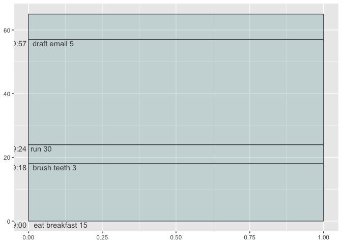
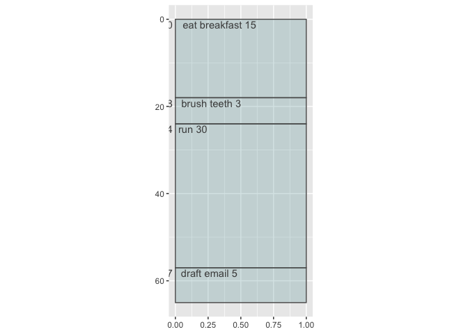

  - [Part 1. Work on functionality](#part-1-work-on-functionality)
      - [Step 0. Do it with base ggplot2 *can become problem statement
        later*](#step-0-do-it-with-base-ggplot2-can-become-problem-statement-later)
      - [Step 0.b Write like-to-have code *code chunk option eval =
        F*](#step-0b-write-like-to-have-code-code-chunk-option-eval--f)
      - [Step 1. Write compute group function and
        test](#step-1-write-compute-group-function-and-test)
      - [Step 2. Pass to ggproto object](#step-2-pass-to-ggproto-object)
      - [Step 3. Write user-facing geom\_pointmeans()
        function](#step-3-write-user-facing-geom_pointmeans-function)
      - [Step 4. Test it out enjoy\! (possibly basis of examples and
        tests)](#step-4-test-it-out-enjoy-possibly-basis-of-examples-and-tests)
      - [Step 5. Write messages/warnings etc in the
        function](#step-5-write-messageswarnings-etc-in-the-function)
  - [Part II. Packaging and documentation 🚧
    ✅](#part-ii-packaging-and-documentation--)
      - [Phase 1. Minimal working
        package](#phase-1-minimal-working-package)
          - [Bit A. Created package archetecture, running
            `devtools::create(".")` in interactive session. 🚧
            ✅](#bit-a-created-package-archetecture-running-devtoolscreate-in-interactive-session--)
          - [Bit B. Added roxygen skeleton? 🚧
            ✅](#bit-b-added-roxygen-skeleton--)
          - [Bit C. Managed dependencies ? 🚧
            ✅](#bit-c-managed-dependencies---)
          - [Bit D. Moved functions R folder? 🚧
            ✅](#bit-d-moved-functions-r-folder--)
          - [Bit E. Run `devtools::check()` and addressed errors. 🚧
            ✅](#bit-e-run-devtoolscheck-and-addressed-errors--)
          - [Bit F. Build package 🚧 ✅](#bit-f-build-package--)
          - [Bit G. Write traditional README that uses built package
            (also serves as a test of build. 🚧
            ✅](#bit-g-write-traditional-readme-that-uses-built-package-also-serves-as-a-test-of-build--)
          - [Bit H. Chosen a license? 🚧 ✅](#bit-h-chosen-a-license--)
          - [Bit I. Add lifecycle badge (experimental) 🚧
            ✅](#bit-i-add-lifecycle-badge-experimental--)
      - [Phase 2: Listen & iterate 🚧 ✅](#phase-2-listen--iterate--)
      - [Phase 3: Let things settle](#phase-3-let-things-settle)
          - [Bit A. Settle on examples. Put them in the roxygen skeleton
            and readme. 🚧
            ✅](#bit-a-settle-on-examples-put-them-in-the-roxygen-skeleton-and-readme--)
          - [Bit B. Written formal tests of functions and save to test
            that folders 🚧
            ✅](#bit-b-written-formal-tests-of-functions-and-save-to-test-that-folders--)
          - [Bit C. Added a description and author information in the
            DESCRIPTION file 🚧
            ✅](#bit-c-added-a-description-and-author-information-in-the-description-file--)
          - [Bit D. Addressed *all* notes, warnings and errors.
            🚧](#bit-d-addressed-all-notes-warnings-and-errors-)
      - [Phase 4. Promote to wider
        audience…](#phase-4-promote-to-wider-audience)
          - [Bit A. Package website built?
            ✅](#bit-a-package-website-built-)
          - [Bit B. Package website deployed? 🚧
            ✅](#bit-b-package-website-deployed--)
      - [Phase 5: Harden/commit](#phase-5-hardencommit)
          - [Submit to CRAN/RUniverse? 🚧](#submit-to-cranruniverse-)
  - [Appendix: Reports, Environment](#appendix-reports-environment)
      - [Edited Description file?](#edited-description-file)

<!-- README.md is generated from README.Rmd. Please edit that file -->

<!-- badges: start -->

<!-- badges: end -->

Let’s build a vanilla ggplot2 Stat and use it in an extension function.

``` r
tasks_df <- tibble::tribble(~my_task, ~time_minutes,
        "eat breakfast", 15,
        "brush teeth", 3,
        "run", 30,
        "draft email", 5
        )
```

# Part 1. Work on functionality

## Step 0. Do it with base ggplot2 *can become problem statement later*

``` r
library(tidyverse)
#> ── Attaching core tidyverse packages ─────────────────── tidyverse 2.0.0.9000 ──
#> ✔ dplyr     1.1.0          ✔ readr     2.1.4     
#> ✔ forcats   1.0.0          ✔ stringr   1.5.0     
#> ✔ ggplot2   3.4.4.9000     ✔ tibble    3.2.1     
#> ✔ lubridate 1.9.2          ✔ tidyr     1.3.0     
#> ✔ purrr     1.0.1          
#> ── Conflicts ────────────────────────────────────────── tidyverse_conflicts() ──
#> ✖ dplyr::filter() masks stats::filter()
#> ✖ dplyr::lag()    masks stats::lag()
#> ℹ Use the conflicted package (<http://conflicted.r-lib.org/>) to force all conflicts to become errors
```

## Step 0.b Write like-to-have code *code chunk option eval = F*

    ggplot(data = cars) + 
      aes(speed, dist) + 
      geom_point() + 
      geom_pointmeans(size = 8)

## Step 1. Write compute group function and test

## Step 2. Pass to ggproto object

reference:
<https://evamaerey.github.io/mytidytuesday/2022-01-03-easy-geom-recipes/easy_geom_recipes.html>

``` r
readme2pkg::chunk_to_r("compute_panel_timebox")
```

``` r
compute_panel_timebox <- function(data, scales, break_time = 3, start_hour = 9){
  
  start_time_scalar <- start_hour * 60
  
  data |> 
    dplyr::mutate(full_time = .data$minutes + break_time) |>
    dplyr::mutate(end_time_minutes = cumsum(.data$full_time)) |>
    dplyr::mutate(start_time_minutes = lag(.data$end_time_minutes) |>
                    replace_na(0)) |>
    dplyr::mutate(clock_start = Sys.Date() + 
             minutes(start_time_minutes) + hours(start_hour)) |>
    dplyr::mutate(clock_end = Sys.Date() + 
             minutes(end_time_minutes) + hours(start_hour)) |>
    dplyr::mutate(y = start_time_minutes) |>
    dplyr::mutate(x = 0) |>
    dplyr::mutate(ymin = start_time_minutes,
           ymax = end_time_minutes) |>
    dplyr::mutate(xmin = 0,
           xmax = 1) |>
    dplyr::mutate(task_and_minutes = paste(task, minutes)) |>
    dplyr::mutate(clock_hour_minute = 
                    hms::as_hms(clock_start) %>% stringr::str_remove("...$"))
  
}

StatTimebox <- ggplot2::ggproto(`_class` = "StatTimebox",
                     `_inherit` = ggplot2::Stat,
                     compute_panel = compute_panel_timebox,
                     required_aes = c("task", "minutes"),
                     default_aes = ggplot2::aes(label =
                                          ggplot2::after_stat(task_and_minutes)))
```

``` r
readme2pkg::chunk_to_r("stamp_workday")
```

``` r
stamp_workday <- function(...){
  annotate(geom = "rect", 
           ymin = 0*60, ymax = -8*60, 
           xmin = -.45, xmax = .45, ... )
}
```

``` r
readme2pkg::chunk_to_r("stamp_currenttime")
```

``` r
stamp_currenttime <- function(..., color = "magenta", alpha = .5, start_hour = 9){
  
  current_time <- (Sys.time() |> hms::as_hms() |> as.numeric()) / 60 - start_hour*60
  
  ggplot2::geom_hline(yintercept = current_time, color = color, alpha = alpha, ...)
  
  }
```

``` r
tasks_df |>
  select(task = my_task, minutes = time_minutes) |>
  compute_panel_timebox()
#> # A tibble: 4 × 15
#>   task          minutes full_time end_time_minutes start_time_minutes
#>   <chr>           <dbl>     <dbl>            <dbl>              <dbl>
#> 1 eat breakfast      15        18               18                  0
#> 2 brush teeth         3         6               24                 18
#> 3 run                30        33               57                 24
#> 4 draft email         5         8               65                 57
#> # ℹ 10 more variables: clock_start <dttm>, clock_end <dttm>, y <dbl>, x <dbl>,
#> #   ymin <dbl>, ymax <dbl>, xmin <dbl>, xmax <dbl>, task_and_minutes <chr>,
#> #   clock_hour_minute <chr>
```

``` r
ggplot(data = tasks_df) + 
  aes(task = my_task, minutes = time_minutes) + 
  layer(stat = StatTimebox, 
        geom = GeomRect, 
        position = "identity") + 
  layer(stat = StatTimebox, 
        geom = GeomText, 
        position = "identity",
        params = list(vjust = 1.1, hjust = -.1)) + 
  coord_trans(y = "reverse")
```

<!-- -->

## Step 3. Write user-facing geom\_pointmeans() function

``` r
readme2pkg::chunk_to_r("stat_timebox")
```

``` r
stat_timebox <- function(mapping = NULL, 
                         data = NULL,
                         geom = GeomRect,
                         position = "identity", 
                         na.rm = FALSE,
                            show.legend = NA,
                            inherit.aes = TRUE, ...) {
  ggplot2::layer(
    stat = StatTimebox,        # proto object from step 2
    geom = geom,   # inherit other behavior
    data = data, 
    mapping = mapping,
    position = position, 
    show.legend = show.legend, 
    inherit.aes = inherit.aes,
    params = list(na.rm = na.rm, ...)
  )
}
```

``` r
readme2pkg::chunk_to_r("coord_transfixed")
```

``` r
CoordTransfixed <- ggplot2::ggproto(`_class` = "CoordTransfixed", 
                       `_inherit` = ggplot2::CoordTrans)

CoordTransfixed$aspect <- function (self, ranges){  # inner function of CoordFixed$aspect
    diff(ranges$y.range)/diff(ranges$x.range) * self$ratio
}

# borrowing from coord_trans set up and adding ratio argument
coord_transfixed <- function (x = "identity", y = "identity", xlim = NULL, ylim = NULL, 
    limx = lifecycle::deprecated(), limy = lifecycle::deprecated(), clip = "on", expand = TRUE, ratio = 1) 
{
    if (lifecycle::is_present(limx)) {
        deprecate_warn0("3.3.0", "coord_trans(limx)", "coord_trans(xlim)")
        xlim <- limx
    }
    if (lifecycle::is_present(limy)) {
        deprecate_warn0("3.3.0", "coord_trans(limy)", "coord_trans(ylim)")
        ylim <- limy
    }
    ggplot2:::check_coord_limits(xlim)
    ggplot2:::check_coord_limits(ylim)
    if (is.character(x)) 
        x <- scales::as.transform(x)
    if (is.character(y)) 
        y <- scales::as.transform(y)
    ggplot2::ggproto(NULL, CoordTransfixed, trans = list(x = x, y = y), 
                     limits = list(x = xlim, y = ylim), expand = expand, 
                     clip = clip, ratio = ratio)
}

coord_canvas <- function(ratio = 1, ...){
  
  coord_transfixed(y = "reverse", ratio = ratio, ...)

}

coord_timebox <- function(ratio = 1/60,  ...){
  
  coord_canvas(ratio = ratio, ...)
  
}
```

## Step 4. Test it out enjoy\! (possibly basis of examples and tests)

``` r
ggplot(data = tasks_df) +
  aes(task = my_task, 
      minutes = time_minutes) + 
  # stamp_workday(alpha = .25, fill = "magenta") +
  stat_timebox(color = "grey35", alpha = .25, fill = "cadetblue") + 
  stat_timebox(geom = "text", color = "grey30", 
               vjust = 1.2, hjust = -0.1, nudge_x = .5,
               lineheight = .7) + 
  stat_timebox(geom = "text", color = "grey30", 
               vjust = 1.2, hjust = 1.1,
               lineheight = .7, 
               aes(label = after_stat(clock_hour_minute))) + 
  stamp_currenttime()
#> Warning in stat_timebox(geom = "text", color = "grey30", vjust = 1.2, hjust =
#> -0.1, : Ignoring unknown parameters: `nudge_x`
```

<!-- -->

``` r

last_plot() + 
  coord_canvas(ratio = 1/60)
```

<!-- -->

``` r

last_plot() + 
  coord_timebox() + 
  scale_x_continuous(expand = expansion(mult = c(.2, 0)))
#> Coordinate system already present. Adding new coordinate system, which will
#> replace the existing one.
```

<!-- -->

``` r


last_plot() + 
  theme_void()
```

<!-- -->

## Step 5. Write messages/warnings etc in the function

# Part II. Packaging and documentation 🚧 ✅

## Phase 1. Minimal working package

### Bit A. Created package archetecture, running `devtools::create(".")` in interactive session. 🚧 ✅

``` r
devtools::create(".")
```

### Bit B. Added roxygen skeleton? 🚧 ✅

Use a roxygen skeleton for auto documentation and making sure proposed
functions are *exported*. Generally, early on, I don’t do much
(anything) in terms of filling in the skeleton for documentation,
because things may change.

### Bit C. Managed dependencies ? 🚧 ✅

Package dependencies managed, i.e. `depend::function()` in proposed
functions and declared in the DESCRIPTION

``` r
usethis::use_package("ggplot2")
usethis::use_package("dplyr") 
usethis::use_package("stringr") 
usethis::use_package("hms") 
```

### Bit D. Moved functions R folder? 🚧 ✅

Use new {readme2pkg} function to do this from readme…

``` r
library(tidyverse)
```

### Bit E. Run `devtools::check()` and addressed errors. 🚧 ✅

``` r
devtools::check(pkg = ".")
```

### Bit F. Build package 🚧 ✅

``` r
devtools::install(upgrade ="never")
```

### Bit G. Write traditional README that uses built package (also serves as a test of build. 🚧 ✅

The goal of the {ggtedious} package is to make it easy to draw posts
(and to learn about package building and testing)

Install package with:

    remotes::install_github("EvaMaeRey/ggvanilla")

Once functions are exported you can remove go to two colons, and when
things are are really finalized, then go without colons (and rearrange
your readme…)

``` r
library(ggtimebox)  
library(ggplot2)

tasks_df <- tibble::tribble(~my_task, ~time_minutes,
        "eat breakfast", 15,
        "brush teeth", 3,
        "run", 30,
        "draft email", 5
        )

ggplot(data = tasks_df) +
  aes(task = my_task, 
      minutes = time_minutes) + 
  ggtimebox:::stat_timebox(color = "grey35", alpha = .25, fill = "cadetblue") + 
  ggtimebox:::stat_timebox(geom = "text", color = "grey30", 
               vjust = 1.2, hjust = -0.1, nudge_x = .5,
               lineheight = .7) + 
  ggtimebox:::stat_timebox(geom = "text", color = "grey30", 
               vjust = 1.2, hjust = 1.1,
               lineheight = .7, 
               aes(label = after_stat(clock_hour_minute))) + 
  # ggtimebox:::stamp_currenttime() + 
  ggtimebox:::coord_timebox() +
  scale_x_continuous(expand = expansion(mult = c(.2,0)))
#> Warning in ggtimebox:::stat_timebox(geom = "text", color = "grey30", vjust =
#> 1.2, : Ignoring unknown parameters: `nudge_x`
```

<!-- -->

### Bit H. Chosen a license? 🚧 ✅

``` r
usethis::use_mit_license()
```

### Bit I. Add lifecycle badge (experimental) 🚧 ✅

``` r
usethis::use_lifecycle_badge("experimental")
```

## Phase 2: Listen & iterate 🚧 ✅

Try to get feedback from experts on API, implementation, default
decisions. Is there already work that solves this problem?

## Phase 3: Let things settle

### Bit A. Settle on examples. Put them in the roxygen skeleton and readme. 🚧 ✅

### Bit B. Written formal tests of functions and save to test that folders 🚧 ✅

That would look like this…

``` r
library(testthat)

test_that("calc times 2 works", {
  expect_equal(times_two(4), 8)
  expect_equal(times_two(5), 10)
  
})
```

``` r
readme2pkg::chunk_to_tests_testthat("test_calc_times_two_works")
```

### Bit C. Added a description and author information in the DESCRIPTION file 🚧 ✅

### Bit D. Addressed *all* notes, warnings and errors. 🚧

## Phase 4. Promote to wider audience…

### Bit A. Package website built? ✅

``` r
usethis::use_pkgdown()
pkgdown::build_site()
```

### Bit B. Package website deployed? 🚧 ✅

## Phase 5: Harden/commit

### Submit to CRAN/RUniverse? 🚧

# Appendix: Reports, Environment

## Edited Description file?

``` r
readLines("DESCRIPTION")
```
